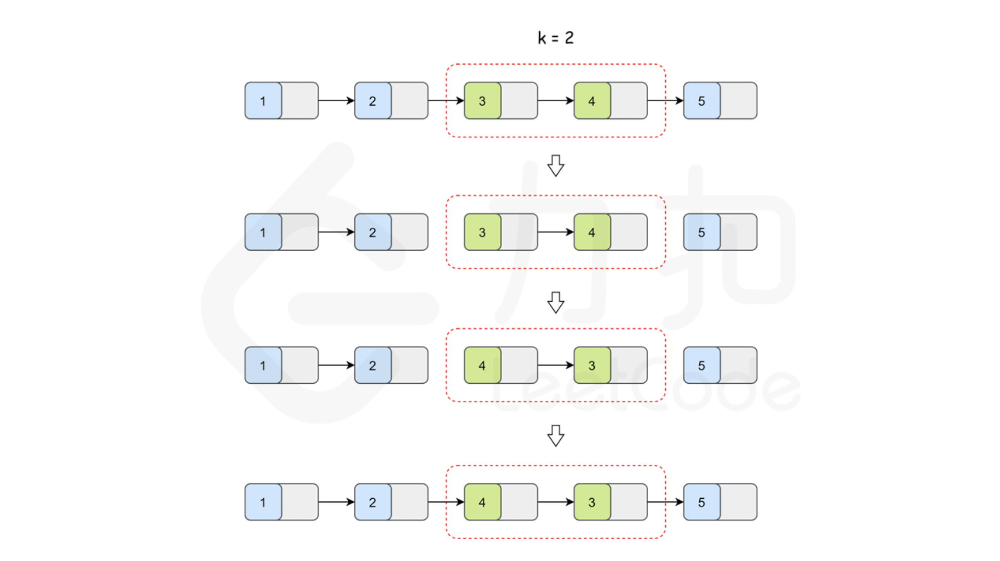

# 25. K 个一组反转链表

## 题目描述

[LeetCode](https://leetcode.cn/problems/reverse-nodes-in-k-group/) 第 25 题

给你链表的头节点 head ，每 k 个节点一组进行翻转，请你返回修改后的链表。
k 是一个正整数，它的值小于或等于链表的长度。如果节点总数不是 k 的整数倍，那么请将最后剩余的节点保持原有顺序。
你不能只是单纯的改变节点内部的值，而是需要实际进行节点交换。

---

示例 1：


```
输入：head = [1,2,3,4,5], k = 2
输出：[2,1,4,3,5]
```

示例 2：


```
输入：head = [1,2,3,4,5], k = 3
输出：[3,2,1,4,5]
```

---

提示：

链表中的节点数目为 n

1 <= k <= n <= 5000

0 <= Node.val <= 1000

进阶：你可以设计一个只用 O(1) 额外内存空间的算法解决此问题吗?

---

## 题解

这道题，思路很清晰，直接根据题意 k 个一组进行反转即可。如下图当 k = 2 时：先找到第一组 node 1 和 node 2，然后进行反转；再找到第二组 node 3 和 node 4，然后进行反转；最后 node 5 不够一组，不反转。



思路很简单，然而，这题在 LeedCode 是一道困难题，那自然是有困难的道理的。短时间内实现起来还是有很多细节很难考虑全的，特别是 ACM 模式下还要自己实现构建链表打印链表等时，如果不是经常刷题的会感觉很是容易出错的（本题解 [完整代码](./reverse_nodes_in_k-group.cpp)中有构建链表、打印链表等相关的助手函数，对于此类问题都可以使用，可保存以备不时之需）。

具体就是分如下几步走：
1. 寻找分组：找满足 k 个一组的 头结点 head 和尾节点 tail
2. 链表反转：头结点 head 到 尾节点 tail 进行反转 (注意这里需要返回反转后的 head 和 tail，以便重新连接到链表中)。
3. 将 2 返回的一个组在链接到链表中。
4. 循环执行 1、2 和 3，直到链表循环一遍。

[完整代码](./reverse_nodes_in_k-group.cpp)

``` c++
class Solution {
public:
    std::pair<ListNode*, ListNode*> reverse(ListNode* head, ListNode* tail) {
        // 从 head 到 tail 进行链表反转。
        // 初始化 p 从 head 触发。
        ListNode* p = head;
        // 直到 p = tail 结束（tail 在反转完后，会是 head 节点，因此这里的思想是将 tail 前的节点正序挨个插入到 tail 后，实现了反转）。
        while (p != tail) {
            // 此时 p 到 tail 之间的节点为都是未处理的节点，但是本次会处理 p 节点。
            // 处理完 p 后，p 节点的前后连接发生了变化，下一个为处理的节点为处理前的 p 节点，已经无法找到，因此需要提前准备一个 next 节点记录下来。
            ListNode* next = p->next;
            p->next = tail->next;
            tail->next = p;
            p = next;
        }
        // 返回值为反转后的 head/tail pair。
        // 因已发生反转，而 输入的 head 和 tail 节点没有发生变化，
        // 所以这里返回值的 head 是输入的 tail，返回值的 tail 为输入的 head。
        return {tail, head};
    }

    ListNode* reverseKGroup(ListNode* head, int k) {
        ListNode dummy(0, head); // 仿 head 节点，为了方便处理第一个节点的反转。这里直接栈内存而不是 new 出来，是后边不想 delete 防止内存泄露。
        ListNode* pre = &dummy;
        while (head) {
            ListNode* tail = pre;
            for (int i = 0; i < k; ++i) {
                // 循环找 k 个 一组
                tail = tail->next;
                if (!tail){
                    // 如果已经到链表结尾，还没到 k 个，那么这一组不用反转
                    return dummy.next;
                }
            }
            std::tie(head, tail) = reverse(head, tail); // 反转一找到的一组
            // 将反转后的组再链接到链表中
            pre->next = head;
            pre = tail;
            head = pre->next;
            // 如果 head 不为空时，继续下一组循环
        }
        return dummy.next;
    }
};
```

## 复杂度分析

* 时间复杂度：O(n)，n 为链表中节点数量。反转链表时间复杂度 O(n), 分组的时间复杂度 O(n)。

* 空间复杂度：O(1)，只需要常数个临时变量。