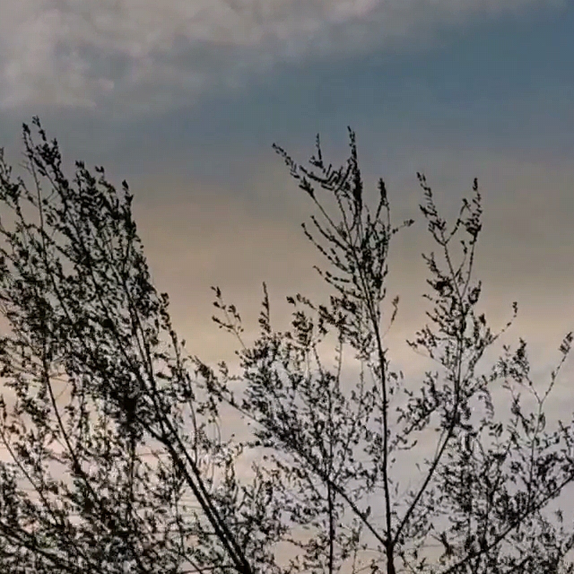

# 朋友圈九宫格制作

## 1. 需要安装

python3 和 [Pillow](https://pillow.readthedocs.io/en/latest/)

## 2. 使用方式

python make_nine_pic.py -i 原始图片 -o 输出文件夹

如: python make_nine_pic.py -i input/dugufei.jpg -o output

## 3. 效果预览

### 1. 原图

### 2. 效果

<table cellspacing="0">
    <tbody>
        <tr>
            <th></th>
            <th></th>
            <th></th>
        </tr>
        <tr>
            <th></th>
            <th></th>
            <th></th>
        </tr>
        <tr>
            <th></th>
            <th></th>
            <th></th>
        </tr>
    </tbody>
</table>
